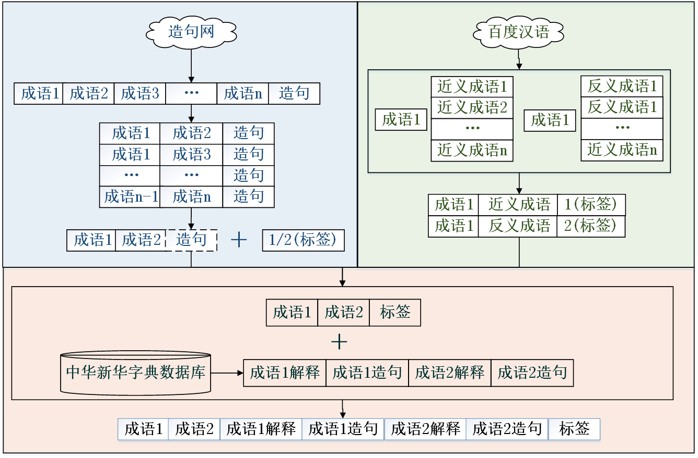
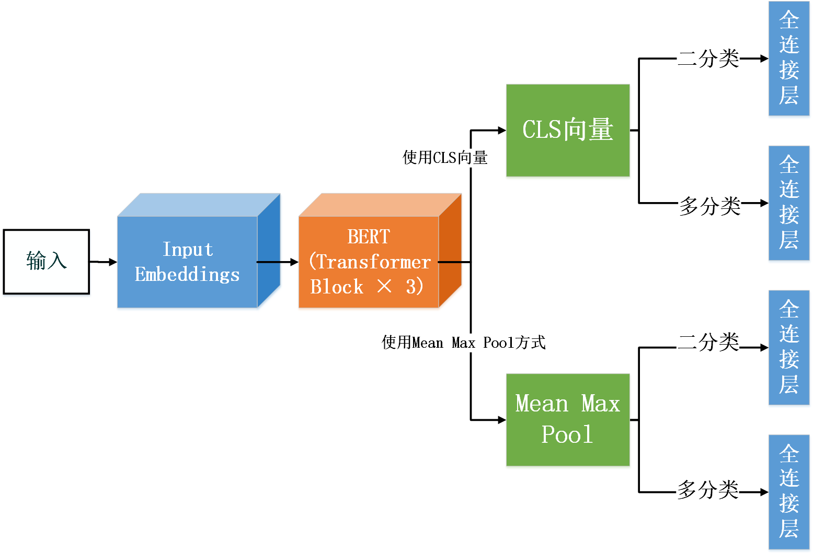
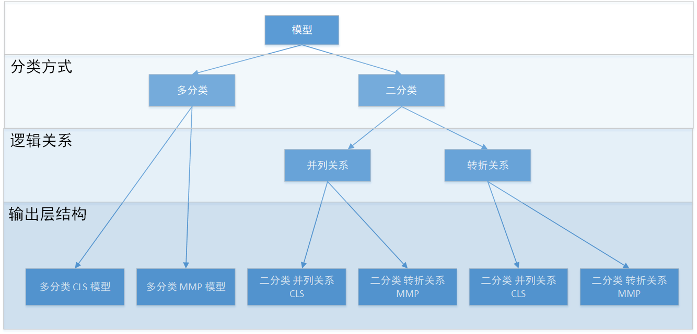
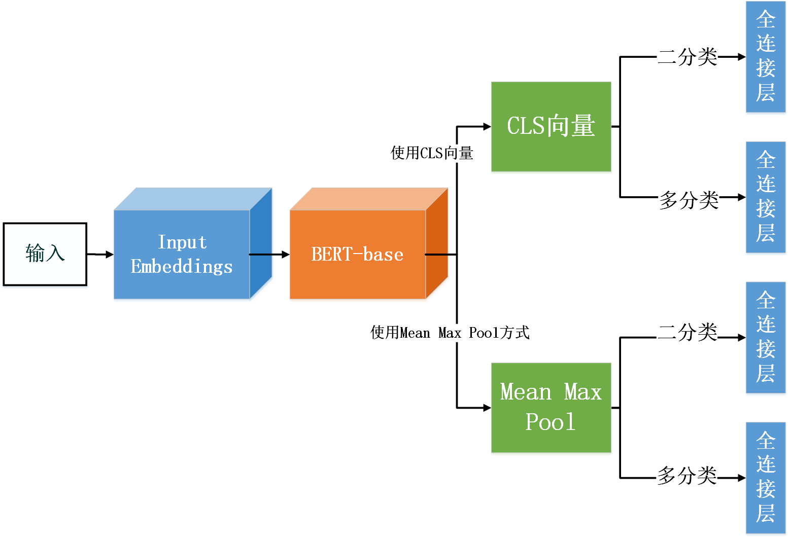

# 汉语成语逻辑关系推断系统设计与实现

## 一、研究背景与意义

> 背景

文章中的成语总能起到点睛之笔的作用，因此对于成语的研究能够从重点切入，**提升文章的质量**。

每种语言的词-句-段之间都有一定的逻辑关系，而汉语里面有数万个成语，某些成语之间也有一些逻辑关系，这些逻辑关系**对文章的整体呈现至关重要。**

> 意义

* 研究领域：成语的逻辑关系推断研究能够让成语间的关系网络更加清晰，完整。
* 应用领域：在成语间的逻辑关系确定之后，可以应用于人们平时写作时的成语推荐，对于写作的用户将会有很好的辅助作用。

> 问题抽象

成语逻辑推断 -> 文本的多分类任务

## 二、技术流程与路线

### 0. 数据集设计

三分类：并列关系 转折关系 无逻辑关系

数据需求：相互具有**并列关系/转折关系**的成语对

* 数据集两点设想（根据设想与数据需求进行数据爬取）：
  * 设想1：具有逻辑关系的成语为一些经常同时出现在同一句子中的成语对
  * 设想2：具有并列关系的成语之间的语义较为相近，可用作并列关系数据；具有转折关系的成语之间的语义较为相反，可用作转折关系数据。

### 1. 爬虫

#### 1.1 造句网爬虫 （根据设想1）

[爬虫网址：造句网](https://zaojv.com/wordcy.html)

爬取数据：爬取多个成语造句的例子，筛去单个成语造句的例子。

数据格式：成语1,成语2,...,成语n,造句 **用","分隔**

数据处理：将**多成语造句**的格式改为**双成语造句**的格式

​					成语1,成语2,...,成语n,造句 -> 成语1,成语2,造句

数据情况：爬取数据包含多成语造句数据`120900`条，总用时`6226s`，约`1h45min`。

数据优点：较为贴合目标问题

数据缺点：(i) 需要人工数据标注，速度较慢，且较为主观 			(ii)标注后可用数据 1：10，剩余1万条左右

#### 1.2 百度汉语爬虫 （根据设想2）

[爬虫网址：百度汉语](https://hanyu.baidu.com)

爬取数据：爬取成语的近义成语和反义成语，再添加[中华新华字典数据库](https://github.com/pwxcoo/chinese-xinhua)中成语的**解释**以及**造句**。

数据格式：

| 成语1  | 成语2  | 成语1解释    | 成语1造句 | 成语2解释    | 成语2造句 | 标签  |
| ------ | ------ | ------------ | --------- | ------------ | --------- | ----- |
| idiom1 | idiom2 | explanation1 | example1  | explanation2 | example2  | label |

#### 1.3 总体数据爬取流程图

### 2. 构建数据集

> 数据处理

* 去重处理

* 正则表达式过滤脏信息

* 添加无逻辑关系数据

  打标签的过程中只标注了`label = 1,2`的数据，现随机找两个成语，标为`label=0`，即无逻辑成语对加入到数据中，`label = 1,2`的数据条数 = `label=0`的数据条数。

* 分割数据集

  将数据打乱后按比例分割为训练集与测试集存储为`IdiomData_train.csv`和`IdiomData_test.csv`，至此数据集构建完成。

* ......

> 数据集数据举例

| **idiom1** | **idiom2** | **explanation1**                                            | **example1**                                                 | **explanation2**                       | **example2** | **label** |
| ---------- | ---------- | ----------------------------------------------------------- | ------------------------------------------------------------ | -------------------------------------- | ------------ | --------- |
| 身临其境   | 亲临其境   | 临到；境境界，地方。亲自到了那个境地。                      | 这篇散文把桂林山水描写得形象逼真，读完使人有身临其境的感觉。 | 临到；境境界，地方。亲自到了那个地方。 | 无           | 1         |
| 忠贯白日   | 何足介意   | 贯贯通。忠诚之心可以贯通白日。形容忠诚无比。亦作忠心贯日”。 | 无                                                           | 指没有必要放在心上。                   | 无           | 0         |
| 前程万里   | 碌碌无为   | 前程前途。比喻前途远大，不可限量。                          | 哥哥荣任是美事，家中自有兄弟支持，不必挂怀。前程万里，须自保重！ | 平平庸庸，无所作为。                   | 无           | 2         |

### 3. 构建模型

* 采用**BERT微调**，添加一至两个处理与输出层并训练。

  * 使用截取#CLS#标签所对应的向量

  * 使用Mean Max Pool

* 输入方案：

  * [CLS]<成语1的解释+举例>[SEP]<成语2的解释+举例>[SEP]

* 模型训练方案
  * 二分类 多模型
  * 多分类 一模型

> 两套模型对比

| **模型名称**          | **包含模型个数** | **能否应用于系统**                       | **准确率情况**               |
| --------------------- | ---------------- | ---------------------------------------- | ---------------------------- |
| 成语逻辑推断BERT模型  | 6                | 模型较小，应用于系统                     | 准确率合格，但未达到预期目标 |
| 基于BERT-base微调模型 | 6                | 模型较大，无法在后端预加载，未应用于系统 | 准确率较高，基本达到预期     |

#### 3.1 成语逻辑推断模型构建 （第一套模型）

> 模型结构图

> 模型分类

> 各成语逻辑推断模型数据集数据情况

| 模型分类方式       | 并列关系数据量 | 转折关系数据量 | 无逻辑关系数据量 | 数据总量 |
| ------------------ | -------------- | -------------- | ---------------- | -------- |
| 多分类模型         | 46036          | 23108          | 34572            | 103716   |
| 二分类模型并列关系 | 46036          | -              | 46036            | 92072    |
| 二分类模型转折关系 | -              | 23108          | 23108            | 46216    |

> 训练环境配置

| **配置名称**     | **配置属性**                              |
| ---------------- | ----------------------------------------- |
| CPU处理器        | Intel(R) Xeon(R) Gold 5218R CPU @ 2.10GHz |
| 主机系统         | Red Hat 4.8.5-28                          |
| GPU显卡处理器    | GeForce RTX 3090                          |
| CUDA版本         | CUDA 11.1                                 |
| 虚拟环境         | Anaconda (python3.6.13)                   |
| 深度学习算法框架 | Pytorch框架                               |
| 编程IDE          | Pycharm                                   |

> 训练结果

| 模型分类方式及输出层结构              | 模型迭代次数 | 模型最低loss | 准确率 |
| ------------------------------------- | ------------ | ------------ | ------ |
| 多分类模型 使用CLS向量                | 58           | 0.919        | 54%    |
| 多分类模型 使用mean max pool          | 78           | 0.901        | 55%    |
| 二分类模型 并列关系 使用CLS向量       | 57           | 0.440        | 88%    |
| 二分类模型 并列关系 使用mean max pool | 29           | 0.422        | 89%    |
| 二分类模型 转折关系 使用CLS向量       | 44           | 0.314        | 94%    |
| 二分类模型 转折关系 使用mean max pool | 45           | 0.309        | 94%    |

总体上，二分类模型的准确率大于多分类模型的准确率

使用Mean Max Pool模型准确率 略大于 使用CLS向量作为输出层的模型准确率

#### 3.2 使用BERT-base微调模型 （第二套模型）

*由于第一套模型准确率没有达到预期*

> 模型结构图

> 训练环境配置

| **配置名称**     | **配置属性**                              |
| ---------------- | ----------------------------------------- |
| CPU处理器        | Intel(R) Core(TM) i7-7700HQ CPU @ 2.80GHz |
| 主机系统         | Windows 10                                |
| GPU显卡处理器    | NVIDIA GeForce GTX 1060                   |
| CUDA版本         | CUDA 10.0                                 |
| 虚拟环境         | Anaconda (python3.7.10)                   |
| 深度学习算法框架 | Keras框架                                 |
| 编程IDE          | Pycharm                                   |

> 训练结果

| 模型分类方式及输出层结构              | loss   | accuracy | val_loss | val_accuracy |
| ------------------------------------- | ------ | -------- | -------- | ------------ |
| 多分类模型 使用CLS向量                | 0.1567 | 0.9484   | 0.0038   | 0.9367       |
| 多分类模型 使用mean max pool          | 0.1787 | 0.9414   | 0.000067 | 0.9302       |
| 二分类模型 并列关系 使用CLS向量       | 0.0741 | 0.9748   | 0.005738 | 0.9678       |
| 二分类模型 并列关系 使用mean max pool | 0.0853 | 0.9702   | 0.007744 | 0.9670       |
| 二分类模型 转折关系 使用CLS向量       | 0.1017 | 0.9640   | 0.000805 | 0.9500       |
| 二分类模型 转折关系 使用mean max pool | 0.1138 | 0.9592   | 0.010322 | 0.9511       |

loss 为训练最后一次迭代训练集的损失值

accuracy 为训练最后一次迭代训练集的准确率

val_loss 为测试集的损失值

val_accuracy 为测试集的准确率

### 4.  系统构建

#### 4.1 前端

* 前端使用Vue.js框架
* 简单使用几个Element UI中的组件
* 使用ECHARTS显示图表

#### 4.2 后端

* 后端使用Flask

#### 4.3 系统展示

## 三、总结与展望

> 总结

* 总体完成度：本次毕业设计完成较为成功，基本达到了预期效果
* 数据集：根据目标问题进行了数据集的设计、爬取、处理与构建
* 模型：设计并构建了两套模型（共12个），分别使用了Pytorch框架和Keras框架，并且达到预期的准确率与效果。
* 系统：设计并实现了简约、美观的交互平台供用户使用。

> 展望

* 成语逻辑关系数据集
  * 继续标注未标注完的数据
  * 标注其它逻辑关系的数据集，完善成语逻辑关系网络】
* 系统实现
  * 添加更多可视化功能
  * 尝试更多训练模型后，将训练数据放入系统中通过图表进行对比

* 成语逻辑推断模型
  * 尝试其它BERT的衍生模型，如BERT-wwm、ALBERT、RoBERTa模型等
  * 将第二套模型部署在性能更好的机器中应用到系统当中。