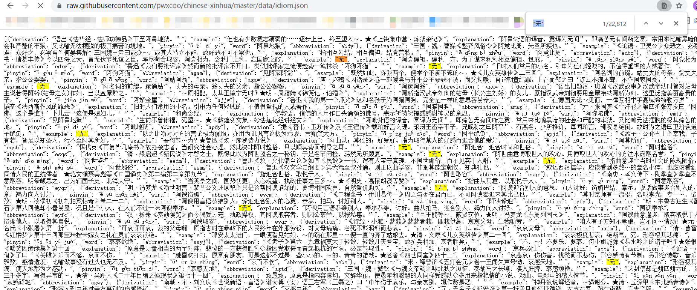

# 汉语成语逻辑关系推断系统设计与实现

## 技术流程与路线

### 1. 爬虫

[爬虫网址：造句网](https://zaojv.com/wordcy.html)

爬取数据：爬取多个成语造句的例子，筛去单个成语造句的例子。

数据格式：成语1,成语2,...,成语n,造句 **用","分隔**

数据处理：将**多成语造句**的格式改为**双成语造句**的格式

​						成语1,成语2,...,成语n,造句 -> 成语1,成语2,造句

**注意：**

* 爬虫时注意`,`的处理

* 注意**去重**

* 保存为`.csv`格式的文件，将**暂存**放于`DataCrawler/MyData`中，将文件分开写入。

  爬取的数据`.csv`文件将**长期**存放于百度网盘。（由于大文件不适合上传到GitHub中）

  ```
  链接：https://pan.baidu.com/s/1DQqQ3Eu45H55tqDJwRYgqg
  提取码：8hs9
  ```
  

爬取数据包含多成语造句数据`120900`条，总用时`6226s`，约`1h45min`。


### 2. 人工打标签

* 暂做**并列关系**与**转折关系**的逻辑关系推断

  多分类：c1,c2,造句,0/1/2
  
  * 无逻辑关系 0 (标注时无逻辑关系的删去，无逻辑关系的数据将在***3.构建数据集***中添加)
  
  * 并列关系     1
  * 转折关系     2
  
* 数据以及文件处理：

  * 由于`.csv`文件无法修改，所以将在`DataProcess.ipynb`中运行脚本将`.csv`转为`.xlsx`，方便打标签，暂存于`DataCrawler/MyXlsx`。
  * 数据中的`header`为`idiom1, idiom2, sentence, label`。（其中label为打标签时手动添加）

* 百度云存放数据：

  ```
  打标签前数据：
  链接：https://pan.baidu.com/s/10leATYc9jEECdVhLQIafwA 
  提取码：ajf9
  打标签后数据：
  *****************************************************
  ```

  

### 3. 构建数据集

本过程将使用：[中华新华字典数据库](https://github.com/pwxcoo/chinese-xinhua)添加爬取数据中每个成语的举例与解释到数据中，使数据格式从`c1,c2,造句,0/1 `-> `c1,c2,c1解释,c2解释,c1举例,c2举例,0/1/2` ，并分割数据集。

（"造句"字段舍去，该字段用于打标签过程中的重要判断依据，在后续过程中没有实际作用）

---

**打完标签后**再运行`DataProcess.ipynb`中的脚本：添加成语的举例`example`以及解释`explanation`数据字段

该过程中包括：

1. 重构`idiom.json`数据格式，方便后续查找操作，将以下格式的数据：

    ```
    [
        {
            "derivation": "语出《法华经·法师功德品》下至阿鼻地狱。”",
            "example": "但也有少数意志薄弱的……逐步上当，终至堕入～。★《上饶集中营·炼狱杂记》",
            "explanation": "阿鼻梵语的译音，意译为无间”，即痛苦无有间断之意。常用来比喻黑暗的社会和严酷的牢狱。又比喻无法摆脱的极其痛苦的境地。",
            "pinyin": "ā bí dì yù",
            "word": "阿鼻地狱",
            "abbreviation": "abdy"
        },
        ...
    ]
    ```

    更改为：

    ```
    {
        "阿鼻地狱":{
            "example": "但也有少数意志薄弱的……逐步上当，终至堕入～。★《上饶集中营·炼狱杂记》",
            "explanation": "阿鼻梵语的译音，意译为无间”，即痛苦无有间断之意。常用来比喻黑暗的社会和严酷的牢狱。又比喻无法摆脱的极其痛苦的境地。"
        },
        ...
    }
    ```

2. 添加**explanation**和**example**字段

   使数据格式从`c1,c2,造句,0/1 `-> `c1,c2,c1解释,c2解释,c1举例,c2举例,0/1/2` 。

   过程中过滤去包含不是成语的数据

3. 添加无逻辑关系数据并分割数据集

   打标签的过程中只标注了`label = 1,2`的数据，现随机找两个成语，标为`label=0`，即无逻辑成语对加入到数据中，`label = 1,2`的数据条数 = `label=0`的数据条数。

   将数据打乱后按比例分割为训练集与测试集存储为`IdiomData_train.csv`和`IdiomData_test.csv`，至此数据集构建完成。

   

### 4. 构建模型

* 采用**BERT微调**，添加一至两个处理与输出层并训练。

  * 使用截取#CLS#标签所对应的向量

  * 使用Mean Max Pool

* 输入方案：

  * [CLS]<成语1的解释>[SEP]<成语2的解释>[SEP]

  * [CLS]<成语1的举例>[SEP]<成语2的举例>[SEP]

    (这种暂不可取 因为[中华新华字典数据库](https://github.com/pwxcoo/chinese-xinhua)中有的成语没有`example`)

    

  * [CLS]<成语1的解释+举例>[SEP]<成语2的解释+举例>[SEP] **现使用这种输入**

* 模型训练方案
  * 二分类 多模型
  * 多分类 一模型

### 5.  构建前端

* 前端使用Vue.js框架
* 简单使用几个Element UI中的组件
* 后端使用Flask